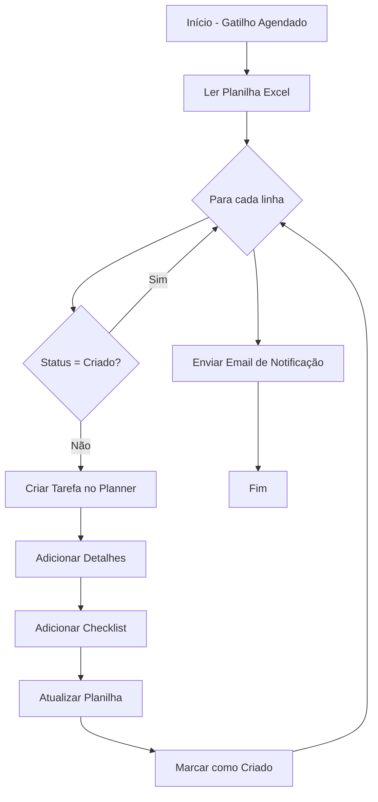

# 📋 Power Automate - Excel para Planner

## 📌 Descrição
Este fluxo do Power Automate automatiza a criação de tarefas no Microsoft Planner a partir de dados em uma planilha Excel armazenada no OneDrive.

## 🚀 Funcionalidades

- ✅ Leitura automática de planilha Excel no OneDrive
- ✅ Criação de tarefas no Microsoft Planner
- ✅ Atribuição automática de responsáveis
- ✅ Definição de prioridades (Alta, Média, Baixa)
- ✅ Adição de checklists nas tarefas
- ✅ Controle de duplicação (não cria tarefas já existentes)
- ✅ Atualização da planilha com status e ID da tarefa criada
- ✅ Notificação por email após processamento

## 📁 Arquivos Incluídos

1. **power-automate-excel-to-planner.json** - Definição do fluxo Power Automate
2. **Import-PowerAutomateFlow.ps1** - Script PowerShell para importação automatizada
3. **tarefas-exemplo.csv** - Planilha de exemplo com estrutura de dados
4. **README-PowerAutomate.md** - Esta documentação

## 🔧 Pré-requisitos

### Licenças Necessárias
- Microsoft 365 com Power Automate
- Microsoft Planner
- OneDrive for Business
- Excel Online

### Permissões Requeridas
- Acesso de leitura/escrita ao OneDrive
- Permissões para criar tarefas no Planner
- Acesso ao ambiente Power Automate

## 📊 Estrutura da Planilha Excel

A planilha deve conter as seguintes colunas:

| Coluna | Tipo | Descrição | Obrigatório |
|--------|------|-----------|-------------|
| **Titulo** | Texto | Título da tarefa | ✅ Sim |
| **Descricao** | Texto | Descrição detalhada da tarefa | ✅ Sim |
| **DataVencimento** | Data/Hora | Data de vencimento (formato ISO 8601) | ✅ Sim |
| **Prioridade** | Texto | Alta, Media ou Baixa | ✅ Sim |
| **Responsavel** | Texto | Nome do responsável | ✅ Sim |
| **Checklist** | Texto | Itens do checklist separados por ";" | ❌ Não |
| **Status** | Texto | Status do processamento | Auto |
| **TaskId** | Texto | ID da tarefa criada no Planner | Auto |
| **DataCriacao** | Data/Hora | Data de criação da tarefa | Auto |

### Formato de Data
Use o formato ISO 8601: `YYYY-MM-DDTHH:MM:SSZ`
Exemplo: `2025-09-25T17:00:00Z`

## 🛠️ Instalação e Configuração

### Método 1: Importação Manual

1. **Preparar a Planilha Excel**
   - Crie uma nova planilha no Excel Online (OneDrive)
   - Copie a estrutura do arquivo `tarefas-exemplo.csv`
   - Formate os dados como Tabela (Inserir > Tabela)
   - Nomeie a tabela como "Table1"

2. **Importar o Fluxo no Power Automate**
   - Acesse [Power Automate](https://flow.microsoft.com)
   - Vá em "Meus fluxos" > "Importar" > "Importar solução do pacote"
   - Selecione o arquivo `power-automate-excel-to-planner.json`

3. **Configurar Conexões**
   - Excel Online (Business)
   - Microsoft Planner
   - Office 365 Outlook (opcional)

4. **Obter IDs Necessários**

   **Para obter o DRIVE_ID e FILE_ID:**
   ```powershell
   # No Power Automate, crie um fluxo de teste
   # Adicione ação "List files in folder" do OneDrive
   # Execute e veja os IDs nos resultados
   ```

   **Para obter o PLAN_ID:**
   - Abra o Planner no navegador
   - O ID está na URL: `https://tasks.office.com/.../_/planId/[PLAN_ID]`

   **Para obter o BUCKET_ID:**
   ```javascript
   // No console do navegador (F12) na página do Planner:
   // Execute este comando:
   angular.element(document.querySelector('[data-bucket-id]')).attr('data-bucket-id')
   ```

   **Para obter o USER_ID:**
   ```powershell
   # Use o Graph Explorer ou PowerShell:
   Get-MgUser -Filter "displayName eq 'Nome do Usuário'" | Select Id
   ```

5. **Atualizar Parâmetros no Fluxo**
   - Edite o fluxo importado
   - Substitua todos os placeholders:
     - `DRIVE_ID`
     - `FILE_ID`
     - `PLAN_ID`
     - `BUCKET_ID`
     - `USER_ID`
     - `EMAIL_DESTINATARIO`

### Método 2: Importação via PowerShell (Automatizada)

1. **Executar o Script de Importação**
   ```powershell
   # Abrir PowerShell como Administrador
   Set-ExecutionPolicy -ExecutionPolicy RemoteSigned -Scope CurrentUser
   
   # Navegar até a pasta dos arquivos
   cd C:\caminho\para\arquivos
   
   # Executar o script
   .\Import-PowerAutomateFlow.ps1 -EnvironmentName "Seu Ambiente"
   ```

2. **Seguir as instruções no console para configuração**

## ⚙️ Configuração do Gatilho

O fluxo está configurado para executar:
- **Frequência**: Diariamente
- **Horário**: 9:00 AM
- **Fuso horário**: UTC (ajustar conforme necessário)

Para modificar:
1. Edite o fluxo no Power Automate
2. Clique no gatilho "Recurrence"
3. Ajuste frequência e horário

## 🔄 Fluxo de Trabalho



## 📝 Personalização

### Adicionar Novos Campos

Para adicionar campos personalizados:

1. **Na Planilha Excel:**
   - Adicione nova coluna
   - Atualize a tabela

2. **No Power Automate:**
   - Edite a ação "Create a task"
   - Adicione o campo usando expressão dinâmica:
     ```
     @{items('Apply_to_each')?['NomeDoCampo']}
     ```

### Modificar Lógica de Prioridade

No fluxo, a prioridade é mapeada assim:
- Alta → 1 (Urgente)
- Média → 5 (Importante)
- Baixa → 9 (Baixa)

Para modificar, edite a expressão:
```
@{if(equals(items('Apply_to_each')?['Prioridade'], 'Alta'), 1, 
  if(equals(items('Apply_to_each')?['Prioridade'], 'Media'), 5, 9))}
```

## 🐛 Solução de Problemas

### Erro: "File not found"
- Verifique se o FILE_ID está correto
- Confirme que o arquivo está no OneDrive configurado
- Verifique permissões de acesso

### Erro: "Plan not found"
- Confirme o PLAN_ID
- Verifique se você tem acesso ao plano
- Certifique-se que o plano não foi excluído

### Tarefas não são criadas
- Verifique a coluna "Status" na planilha
- Confirme que as datas estão no formato correto
- Verifique os logs de execução no Power Automate

### Erro de autenticação
- Reconecte as conexões no Power Automate
- Verifique se as licenças estão ativas
- Confirme permissões no Azure AD

## 📊 Monitoramento

### Visualizar Execuções
1. Acesse Power Automate
2. Vá em "Meus fluxos"
3. Clique no fluxo
4. Selecione "Histórico de execuções"

### Métricas Importantes
- Taxa de sucesso
- Tempo médio de execução
- Número de tarefas criadas
- Erros recorrentes

## 🔒 Segurança

### Boas Práticas
- ✅ Use conexões com autenticação MFA
- ✅ Limite acesso à planilha Excel
- ✅ Configure alertas para falhas
- ✅ Revise permissões regularmente
- ✅ Mantenha logs de auditoria

### Dados Sensíveis
- Evite incluir senhas na planilha
- Use Azure Key Vault para credenciais
- Criptografe dados sensíveis

## 📚 Recursos Adicionais

- [Documentação Power Automate](https://docs.microsoft.com/power-automate/)
- [API do Microsoft Planner](https://docs.microsoft.com/graph/api/resources/planner-overview)
- [Referência de Expressões](https://docs.microsoft.com/azure/logic-apps/workflow-definition-language-functions-reference)
- [Conectores Disponíveis](https://docs.microsoft.com/connectors/)

## 🤝 Suporte

Para problemas ou dúvidas:
1. Verifique esta documentação
2. Consulte os logs de execução
3. Abra um ticket no suporte Microsoft 365
4. Consulte a comunidade Power Automate

## 📄 Licença

Este código é fornecido como exemplo e pode ser modificado conforme necessário para atender aos requisitos específicos da sua organização.

---

**Versão**: 1.0.0  
**Última Atualização**: Setembro 2025  
**Autor**: Sistema Automatizado